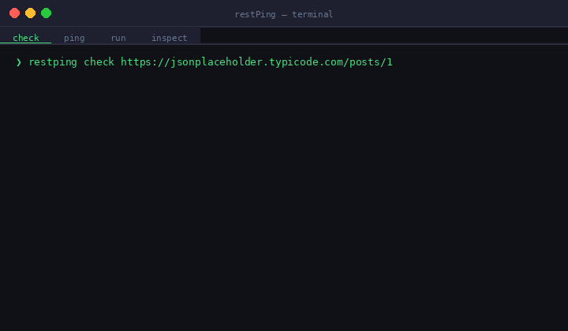

<div align="center">


# restPing

**A lightweight CLI tool to test, monitor and analyze REST APIs from your terminal**




</div>

---

## Why restPing?

Every developer has been here:
"Is my API down or is it just my code?"
"Which of my endpoints are slow?"
"I got a JSON response — what Java class do I need to parse it?"

**Postman is too heavy. `curl` is hard to remember. There's nothing simple in between.**

restPing is a zero-config, terminal-native CLI tool that solves all of this in one place.

---

## 🟢 Beginner Friendly

**Just learning APIs? This tool was built for you.**

restPing is perfect if you are:
- A Java developer learning REST APIs for the first time
- Tired of copy-pasting JSON into browser tools to understand the structure
- Looking for a real project to learn HTTP, JSON, and CLI development

Every command has a clear purpose and simple output. No configuration files, no accounts, no setup — just run and see results instantly.

> 💡 **Pro tip for beginners:** Start with `check` to test your first API, then use `inspect` to auto-generate the Java class you need to parse the response. Two commands replace hours of manual work.

---

## Features

| Command | What it does |
|---|---|
| `check` | Test if an API endpoint is alive — status, response time, body preview |
| `ping` | Hit an endpoint N times and get avg / min / max response time stats |
| `run` | Test multiple endpoints at once from a simple JSON config file |
| `inspect` | Analyze any JSON response and auto-generate a ready-to-use Java class |

---

## Quick Start

### Prerequisites
- Java 17 or above
- Maven

### Build from source

```bash
git clone https://github.com/Ashwanthjava/restPing.git
cd restPing
mvn package
java -jar target/restping-1.0.0.jar --help
```

---

## Commands

### `check` — Is my API alive?

```bash
java -jar restping.jar check https://jsonplaceholder.typicode.com/posts/1
```

🌐 URL    : https://jsonplaceholder.typicode.com/posts/1
✅ Status : 200
⏱  Time   : 143ms
📦 Body   : { "userId": 1, "id": 1, "title": "..." }...

---

### `ping` — How fast is my API?

```bash
java -jar restping.jar ping https://jsonplaceholder.typicode.com/posts/1 --count 5
```
Pinging https://jsonplaceholder.typicode.com/posts/1 5 times...
[1] ✅ Status: 200 | Time: 1560ms
[2] ✅ Status: 200 | Time: 144ms
[3] ✅ Status: 200 | Time: 102ms
[4] ✅ Status: 200 | Time: 98ms
[5] ✅ Status: 200 | Time: 113ms
✅ Success : 5/5
⏱  Avg     : 403ms
⬇️  Min     : 98ms
⬆️  Max     : 1560ms

---

### `run` — Test all my endpoints at once

Create an `endpoints.json` file:

```json
{
  "endpoints": [
    { "name": "Get Post",     "url": "https://jsonplaceholder.typicode.com/posts/1" },
    { "name": "Get Users",    "url": "https://jsonplaceholder.typicode.com/users" },
    { "name": "Get Comments", "url": "https://jsonplaceholder.typicode.com/comments" }
  ]
}
```

```bash
java -jar restping.jar run ./endpoints.json
```
Running 3 endpoints...
✅ Get Post              | 200 | 143ms
✅ Get Users             | 200 | 210ms
✅ Get Comments          | 200 | 178ms
Result: 3/3 endpoints healthy

---

### `inspect` — What Java class do I need for this API?

The most unique feature of restPing. Hit any URL and instantly get a ready-to-use Java class — no browser tools, no manual work.

```bash
java -jar restping.jar inspect https://jsonplaceholder.typicode.com/users/1
```
📋 JSON Structure
Root: Object
├── id → int
├── name → String
├── address (object)
│    ├── street → String
│    ├── city → String
│    ├── geo (object)
│    │    ├── lat → String
│    │    ├── lng → String
💡 Suggested Java Class:
public class Root {
int id;
String name;
Address address;
static class Address {
String street;
String city;
Geo geo;

    static class Geo {
        String lat;
        String lng;
    }
}
}
✅ Copy this class into your project and use with Gson

---

## Project Structure
restPing/
├── src/main/java/restping/
│   ├── Main.java
│   ├── commands/
│   │   ├── CheckCommand.java
│   │   ├── PingCommand.java
│   │   ├── RunCommand.java
│   │   └── InspectCommand.java
│   ├── http/
│   │   └── ApiClient.java
│   ├── model/
│   │   ├── ApiResponse.java
│   │   ├── Endpoint.java
│   │   └── EndpointConfig.java
│   ├── printer/
│   │   └── ResponsePrinter.java
│   └── analyzer/
│       └── JsonAnalyzer.java
├── endpoints.json
└── pom.xml

---

## Built With

- [Java 17](https://openjdk.org/) — core language
- [Picocli](https://picocli.info/) — CLI framework
- [Gson](https://github.com/google/gson) — JSON parsing
- [Maven](https://maven.apache.org/) — build tool

---

## Roadmap

- [ ] POST request support
- [ ] Bearer token authentication via `--auth-token`
- [ ] `--output` flag to save generated Java class to a `.java` file
- [ ] HTML report generation for `run` command
- [ ] Watch mode — continuously monitor an endpoint

---

## Contributing

Contributions are welcome! If you find a bug or have a feature idea, open an issue or submit a pull request.

---

## License

MIT License — free to use, modify and distribute.

---

<div align="center">

Made with ☕ by [Ashwanthjava](https://github.com/Ashwanthjava)

If this tool saved you time, consider giving it a ⭐

</div>